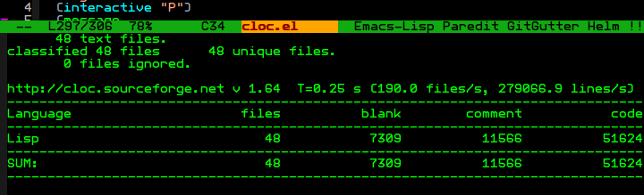

cloc-emacs
==========

[![melpa badge][melpa-badge]][melpa-link]
[![melpa stable badge][melpa-stable-badge]][melpa-stable-link]

This is a small attempt at cloc integration for Emacs. The functionality is exposed through two functions: `cloc`, an interactive function which performs a search through all buffers whose filepaths match the given regex (or the current buffer, as desired), and counts lines of code in them. It also exposes `cloc-get-results-as-plists`, a non-interactive function which does the same thing, but parses and organizes it all into a list of plists for easier analysis.

cloc will search over all buffers, including those which do not visit files, and tramp buffers, but if the buffer is not visiting a file (and therefore does not have a pathname), cloc will only be able to match the regex to the buffer's buffer-name.

Example searches include:

- `\.cpp$`, for all C++ source files
- `/foo/`, where `"/foo/"` is the name of a project directory
  - cloc will then count all code over all open buffers visiting files within a directory named foo.

# Setup:

```elisp
;; do this only once ever
(package-install 'cloc)
;; put this in your .emacs init file
(require 'cloc)
```

# Usage:

- `M-x cloc`: Interactive function to run the executable "cloc" over all buffers with pathname specified by a regex. If a prefix argument or a blank regex is given, the current buffer is "cloc'd". cloc's entire summary output is given in the messages buffer.

- `cloc-get-results-as-plists`: Non-interactive function to get output of cloc results as a list of plists. Each plist contains as a property the number of files analyzed, the blank lines, the code lines, comment lines, etc. for a given language in the range of files tested. If prefix-given is set to true, this runs on the current buffer. If not, and a regex is given, it will search file-visiting buffers for file paths matching the regex. If the regex is nil, it will prompt for a regex; putting in a blank there will default to the current buffer.

# Screenshot:



[melpa-link]: http://melpa.org/#/cloc
[melpa-stable-link]: http://stable.melpa.org/#/cloc
[melpa-badge]: http://melpa.org/packages/cloc-badge.svg
[melpa-stable-badge]: http://stable.melpa.org/packages/cloc-badge.svg
